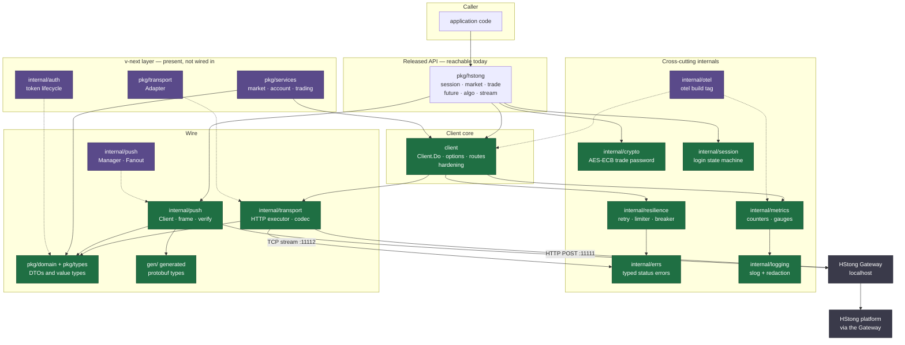

# Architecture

How `hstongapi4go` is put together, derived from the GitNexus knowledge graph for
this repository plus verification against the source.

- **Graph:** 6,367 nodes · 17,061 edges · 219 clusters · 518 execution flows
- **Method:** clusters aggregated by label, execution flows joined through
  `STEP_IN_PROCESS`, and package dependencies read from `IMPORTS` edges
- **Design rationale:** [docs/DESIGN.md](./docs/DESIGN.md) · **Decisions:**
  [docs/adr/README.md](./docs/adr/README.md) · **Adversarial analysis:**
  [docs/threat-model.md](./docs/threat-model.md)

> The graph is a static approximation. Two known limits are called out in
> [Known limits](#known-limits-of-this-document); the most important is that the
> v-next layer is present in the graph but **not reachable by a caller**.

## 1. Overview

`hstongapi4go` is a Go client SDK for the HStong (華盛) Quant OpenAPI **local
Gateway**. The Gateway is a separate process on loopback that owns platform
connectivity, login, request signing, and platform keys; the SDK holds no
platform credentials and performs no signing ([ADR 0001](./docs/adr/0001-gateway-transport.md),
[ADR 0005](./docs/adr/0005-key-model-and-push-verification.md)).

Two transports, both to `127.0.0.1`:

- **HTTP `POST :11111`** — 51 endpoints behind a `{"timeout_sec", "params"}` /
  `{"ok", "err", "data"}` envelope, plain JSON.
- **TCP `:11112`** — a fixed 151-byte frame header carrying binary protobuf
  `PBNotify` messages, decoded by `Any` type URL.

The canonical endpoint and topic inventory is
[docs/SPEC.md](./docs/SPEC.md) and is deliberately not restated here.

The repository contains **two SDK layers**. The **released** layer (`client`,
`pkg/hstong`, `internal/*`) is what callers use. The **v-next** layer (`pkg/domain`,
`pkg/services`, `pkg/transport`, `internal/auth`) was added in the 2026-09-23
enterprise run and is **not yet wired in** — see [§5](#5-the-v-next-layer-is-present-but-unreachable).

## 2. Functional areas

The graph's 219 Leiden communities collapse into these areas. Symbol counts are
summed across the communities carrying each label.

| Area | Symbols | Packages | Role |
|------|--------:|----------|------|
| Push | 216 | `internal/push`, `pkg/hstong/stream` | Framing, decode, reconnect, dispatch, fan-out |
| Transport | 95 | `internal/transport`, `client` | HTTP executor, envelope, codec dispatch |
| Domain | 83 | `pkg/domain`, `pkg/types` | Wire DTOs and v-next value types |
| Trade | 78 | `pkg/hstong/trade`, `pkg/services` | Order lifecycle and account queries |
| Integration | 69 | `test/e2e`, `test/integration`, `test/mockgateway` | Offline end-to-end and mock Gateway |
| Services | 60 | `pkg/services` | v-next use cases (market, account, trading) |
| Notify | 58 | `gen/*/notify`, `internal/push` | Protobuf notification types |
| Mockgateway | 57 | `test/mockgateway` | 51-route offline Gateway and push server |
| Dto | 53 | `gen/hq/dto` | Generated market DTOs |
| Resilience | 48 | `internal/resilience` | Retry, rate limit, circuit breaker |
| Auth | 48 | `internal/auth`, `internal/crypto`, `internal/session` | Password crypto, token lifecycle, session state |
| Algo | 45 | `pkg/hstong/algo` | Algo-trading endpoints |
| Stream | 43 | `pkg/hstong/stream` | Subscription and push event API |
| Metrics | 38 | `internal/metrics`, `internal/otel` | Counters, gauges, histograms, OTel bridge |
| Client | 32 | `client` | Construction, options, routes, hardening |
| Logging | 28 | `internal/logging` | `slog` with secret redaction |
| Otel | 25 | `internal/otel` | Tracing and metrics behind the `otel` tag |

## 3. Diagram



Dashed edges are conditional: the `otel` packages compile only under the `otel`
build tag, and everything in the v-next layer is unreferenced by the released API.

## 4. Key execution flows

Selected by centrality and consequence rather than by step count — the
auto-generated flow labels are dominated by repetitive metrics and error-mapping
chains. Traces come from the graph's `STEP_IN_PROCESS` edges.

### 4.1 `client.Client.Do` — every HTTP call in the released SDK

The single chokepoint. 12 flows originate here, the most of any entry point.

```
1. Client.Do            client/client.go
2.   execute            client/client.go
3.     attempt          client/client.go
4.       Transport.Do   internal/transport/transport.go
5.       Count          internal/metrics/metrics.go
6.       Record         internal/otel/otel.go
7.         getCounter   internal/otel/otel.go
```

`Client.Do` resolves the route, gates on the query and mutation circuit breakers,
enters the retry policy, and delegates a single attempt to
`internal/transport.Transport.Do`, which owns the envelope and the per-endpoint
codec. Metrics and, under the `otel` tag, spans are emitted on the same path. The
retry classification in `internal/resilience` is the enforcement point for
[ADR 0003](./docs/adr/0003-no-auto-retry-orders.md).

### 4.2 `resilience.Policy.Do` — the no-auto-retry gate

```
1. Policy.Do            internal/resilience/retry.go
2.   attempt            client/client.go
3.     RateLimitWait    internal/metrics/metrics.go
4.     Count            internal/metrics/metrics.go
5.       Record         internal/metrics/metrics.go
6.         getCounter   internal/otel/otel.go
```

`Policy.Do` forces `max = 1` for any path classified as a mutation, so order,
futures, and algo mutations issue exactly one attempt at every configuration.
Classification is a closed set in `mutationPaths`; route aliases
(`…Request`, `…RequestMsgType`) are stripped before lookup.

### 4.3 `trade.Manager.Entrust` — order submission

```
1. Entrust          pkg/hstong/trade/orders.go
2.   validate       pkg/hstong/trade/orders.go
3.     EnsureLoggedIn  pkg/hstong/session.go
4.       State      internal/session/state.go
5.     Error       internal/errs/errors.go
```

Local validation runs first, then single-flight session enforcement, then the
call is classified as a mutation. Note what is **absent**: no retry step. That
absence is the ADR 0003 guarantee, and it is why an ambiguous failure returns a
typed error asking the caller to reconcile rather than resubmitting.

### 4.4 `auth.Authenticator.Login` — session and token lifecycle

```
1. Login          internal/auth/authenticator.go
2.   GetSession   internal/auth/token_manager.go
3.     Now        internal/auth/session_security_test.go
4.   encryptECB   internal/crypto/aes.go
5.     pkcs7Pad   internal/crypto/aes.go
```

The trade password is AES-192-ECB/PKCS7 encrypted with the published protocol key
before it leaves the process, then the returned token is stored with a computed
expiry and refresh time. The `Clock` is injectable, which is what makes token
expiry testable without wall-clock dependence.

### 4.5 `push.Manager.readLoop` — push ingest and reconnect

```
1. readLoop            internal/push/manager.go
2.   reconnectLoop     internal/push/manager.go
3.     reportError     internal/push/manager.go
4.     sendTopicRequest  internal/push/manager.go
5.       buildTopicRequest  internal/push/manager.go
```

The read loop consumes 151-byte frames, skips heartbeats, decodes `PBNotify`
payloads, and on a read error closes the connection and walks the reconnect
ladder, then reissues every stored subscription. This is the v-next `Manager`;
the released stream API uses `internal/push.Client`, which has a separate
lifecycle.

## 5. The v-next layer is present but unreachable

Verified by import search, not inferred:

| Package | Imported by production code? |
|---------|------------------------------|
| `pkg/domain` | Yes — by `internal/push`, `internal/auth`, `pkg/services` |
| `pkg/services` | Only from tests; calls `client` directly |
| `pkg/transport` | `pkg/services/account.go`, and only for the `Pagination` type |
| `pkg/transport.Adapter` | **Nothing.** No production caller |
| `internal/auth` | **Nothing** — only `scripts/coverage_gate.go` |
| `internal/push.Manager`, `.Fanout` | **Nothing** — tests only |

Consequences worth stating plainly:

1. Three of the four `internal/push` implementations are not on the live path.
   `Client` (released), `Manager`, and `Fanout` each own a connection lifecycle
   and they disagree about reconnect bounds and backpressure.
2. The v-next auth hardening protects no caller today.
3. `pkg/services` calls `client` directly instead of going through
   `pkg/transport.Adapter`, so the adapter is bypassed even from the layer that
   was meant to use it.

## 6. Layering deviations

Read directly from `IMPORTS` edges and checked against the source. Each
contradicts a boundary stated in ADR 0010 or in a package's own doc comment.

| Declared boundary | Actual | Evidence |
|-------------------|--------|----------|
| `pkg/domain` depends on stdlib and `decimal` only | It imports generated code | `pkg/domain/market.go:11`, `pkg/domain/symbol.go:7` import `gen/hq/dto` |
| `pkg/services` depends on `domain` plus service interfaces | It imports `client` | `pkg/services/account.go:9`, `market.go:10`, `trading.go:12` |
| `pkg/transport` implements the service interfaces | Nothing consumes it | no production importer of `Adapter` |
| Generated code is reached only through transport | `pkg/domain` reaches `gen/` directly | 27 `IMPORTS` edges `pkg/domain → gen/hq/dto` |

These are recorded as candidates in
[the next-phase plan](./docs/runs/2026-09-23-hstong-enterprise-sdk/next-phase.md)
rather than fixed here, because deciding the v-next layer's fate is a product
decision, not a refactor.

## 7. Request and event lifecycles

**HTTP request.** `pkg/hstong` manager → `client.Client.Do` (route, breakers) →
`resilience.Policy.DoRoute` (classification, single-attempt for mutations) →
`internal/transport.Transport.Do` (envelope, deadline, codec) → Gateway. Response
`ok:false` becomes a typed `internal/errs.Error` carrying a `types.StatusCode`.

**Push event.** Gateway frame → `internal/push.ReadFrame` (151-byte header,
length and compression checks) → `PBNotify` → `Any` unpack by `notifyMsgType` →
optional `SHA1WithRSA` verification → typed accessor on the stream `Event` →
dispatch to per-type queues with drop-oldest backpressure.

**Domain conversion (v-next).** `pkg/transport` mappers convert generated DTOs
into `pkg/domain` values, so the domain sees decimals and typed IDs rather than
wire strings.

## 8. Known limits of this document

- **Flows are truncated.** The analyzer reported that 230 of 430 candidate entry
  points never ranked into the 518 recorded flows, and 473 callees were skipped at
  the branching cap. An absent flow does not mean the code path does not exist.
- **Clusters are fine-grained.** The 219 Leiden communities are much smaller than
  the 27 areas in §2; labels repeat across communities, which is why the table
  sums them.
- **The index is a point-in-time snapshot** taken at commit `bc4d1a4`, counting
  6,367 nodes across 309 indexed files. Re-run `gitnexus analyze` after landing
  further commits.
- **Structural claims were verified against source**, not taken from the graph
  alone. Every statement in §5 and §6 was confirmed by import search; the
  diagram's edges come from the graph but the conclusions were checked by hand.
- **Search was unavailable.** Full-text/BM25 search is disabled on this host
  because the LadybugDB FTS extension cannot load, so all findings here come from
  structural graph queries rather than keyword search.
