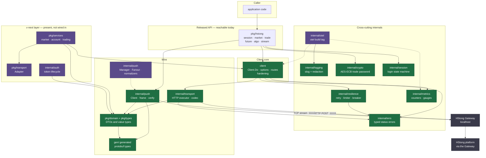

# Architecture

How `hstongapi4go` is put together, derived from the GitNexus knowledge graph for
this repository and then verified against the source.

- **Graph:** 6,382 nodes · 17,083 edges · 219 clusters · 518 execution flows
  (425 cross-community, 93 intra-community) across 311 indexed files
- **Index point:** commit `eb00cbd` (2026-09-25)
- **Method:** Leiden communities aggregated by label, execution flows joined
  through `STEP_IN_PROCESS`, package dependencies read from `IMPORTS` edges and
  rolled up to package level
- **Design rationale:** [docs/DESIGN.md](./docs/DESIGN.md) · **Decisions:**
  [docs/adr/README.md](./docs/adr/README.md) · **Adversarial analysis:**
  [docs/threat-model.md](./docs/threat-model.md)

> The graph is a static approximation with real limits, listed in
> [§8](#8-known-limits-of-this-document). The most consequential finding is that
> the v-next layer is fully present in the graph but **not reachable by a caller**.

## 1. Overview

`hstongapi4go` is a Go client SDK for the HStong (華盛) Quant OpenAPI **local
Gateway**. The Gateway is a separate process on loopback that owns platform
connectivity, login, request signing, and platform keys; the SDK holds no
platform credentials and performs no signing ([ADR 0001](./docs/adr/0001-gateway-transport.md),
[ADR 0005](./docs/adr/0005-key-model-and-push-verification.md)).

Two transports, both to `127.0.0.1`:

- **HTTP `POST :11111`** — 51 endpoints behind a `{"timeout_sec", "params"}` /
  `{"ok", "err", "data"}` envelope, plain JSON.
- **TCP `:11112`** — a fixed 151-byte frame header carrying binary protobuf
  `PBNotify` messages, decoded by `Any` type URL.

The canonical endpoint and topic inventory is
[docs/SPEC.md](./docs/SPEC.md) and is deliberately not restated here.

The repository contains **two SDK layers**. The **released** layer (`client`,
`pkg/hstong`, `internal/*`) is what callers use. The **v-next** layer (`pkg/domain`,
`pkg/services`, `pkg/transport`, `internal/auth`) was added by the 2026-09-23
enterprise run and is **not wired in** — see [§5](#5-the-v-next-layer-is-present-but-unreachable).

## 2. Functional areas

The graph's 219 Leiden communities collapse into 26 areas. Symbol counts are
summed across every community carrying each label; packages are the four with
the most members.

| Area | Symbols | Leading packages | Role |
|------|--------:|------------------|------|
| Push | 216 | `internal/push`, `test/integration`, `gen/common/msg`, `gen/hq/notify` | Framing, decode, reconnect, dispatch, fan-out |
| Transport | 95 | `internal/transport`, `pkg/transport`, `client`, `internal/errs` | HTTP executor, envelope, codec dispatch, v-next adapter |
| Domain | 83 | `pkg/domain`, `pkg/services`, `pkg/transport` | Wire DTOs and v-next value types |
| Trade | 78 | `pkg/hstong`, `internal/errs` | Order lifecycle and asset queries |
| Integration | 69 | `test/integration`, `pkg/hstong`, `examples`, `test/e2e` | Offline end-to-end and mock Gateway |
| Services | 60 | `pkg/services`, `pkg/domain`, `internal/errs`, `pkg/hstong` | v-next use cases (market, account, trading) |
| Notify | 58 | `gen/trade/notify`, `gen/hq/notify`, `pkg/hstong`, `internal/push` | Protobuf notification types and decoding |
| Mockgateway | 57 | `test/mockgateway`, `test/e2e`, `cmd`, `gen/hq/dto` | 51-route offline Gateway and push server |
| Dto | 53 | `gen/hq/dto`, `pkg/transport`, `gen/hq/notify`, `internal/push` | Generated market DTOs |
| Resilience | 48 | `internal/resilience`, `client`, `internal/errs` | Retry policy, rate limit, circuit breakers |
| Auth | 48 | `internal/auth` | Password crypto, token lifecycle (v-next) |
| Algo | 45 | `pkg/hstong` | Algo-trading endpoints |
| Stream | 43 | `pkg/hstong`, `client`, `internal/push`, `gen/trade/notify` | Subscription and push event API |
| Metrics | 38 | `internal/metrics`, `client` | Counters, gauges, histograms |
| Client | 32 | `client` | Construction, options, routes, hardening |
| Logging | 28 | `internal/logging` | `slog` with secret redaction |
| Future | 27 | `pkg/hstong` | Futures endpoints and delivery push |
| Otel | 25 | `internal/otel`, `client` | Tracing and metrics behind the `otel` tag |
| Market | 24 | `pkg/hstong` | Market pull endpoints and subscriptions |
| Scripts | 20 | `scripts` | Money check, coverage gate, SBOM, doc checks |
| Errs | 19 | `internal/errs`, `internal/transport`, `pkg/hstong` | Typed status errors |
| Session | 15 | `internal/session`, `internal/auth`, `pkg/hstong` | Login state machine |
| Hstong | 14 | `pkg/hstong` | Session manager surface |
| Crypto | 8 | `internal/crypto`, `internal/auth` | AES-192-ECB/PKCS7 trade password |
| Msg | 8 | `gen/common/msg` | Generated envelope and notify messages |
| Constant | 4 | `gen/common/constant` | Generated shared constants |

Two cross-cutting symbols dominate call-graph fan-in rather than belonging to
any one feature: `internal/errs.New` participates in **183** distinct flows, the
widest in the repository, and `internal/metrics.Count` in **34**.

## 3. Diagram

Edges are `IMPORTS` relationships between packages, confirmed in source.



Dashed edges are conditional: the `otel` packages compile only under the `otel`
build tag, and `internal/push.Manager`, `.Fanout`, and the normalizers have no
production caller. The `pkg/domain → gen` edge is a real dependency that
contradicts the declared boundary — see [§6](#6-layering-deviations).

## 4. Key execution flows

Selected by centrality and consequence, not by step count: the auto-generated
flow labels are dominated by repetitive metrics and error-mapping chains
(`Do → GetCounter`, `Do → Error`, and similar). Traces are `STEP_IN_PROCESS`
edges from the current index.

### 4.1 Client construction — `examples/algo/main.go` → `client.New`

```
1. main            examples/algo/main.go
2.   New           client/client.go
3.     New         internal/transport/transport.go
4.       Config    internal/transport/transport.go
```

`client.New` applies functional options in order over defaults, then constructs
the transport that owns the envelope and per-endpoint codec. `client.New`
participates in 30 flows and `applyEnv`/`WithEnv` in 18 each, so configuration
is the most fan-in-heavy path in the released layer after error construction.

### 4.2 Every HTTP call — retry gate to transport

```
1. Do            internal/resilience/retry.go
2.   attempt     client/client.go
3.     Do        internal/transport/transport.go
4.       timeoutSeconds   internal/transport/transport.go
```

`resilience.Policy.Do` classifies the route and forces `max = 1` for anything in
`mutationPaths`, so trade, futures, and algo mutations issue exactly one attempt
at every configuration ([ADR 0003](./docs/adr/0003-no-auto-retry-orders.md)).
`client.attempt` performs the single outbound call and `transport.Do` owns the
`{"timeout_sec","params"}` envelope, the deadline, and the codec dispatch. The
metrics and OTel span chain hangs off this same path:

```
1. Do            client/client.go
2.   execute     client/client.go
3.     attempt   client/client.go
4.       RateLimitWait   internal/metrics/metrics.go
5.       Count           internal/metrics/metrics.go
6.       Record          internal/otel/otel.go
7.         getCounter    internal/otel/otel.go
```

### 4.3 Order submission — `trade.Manager.Entrust`

```
1. Entrust          pkg/hstong/trade/orders.go
2.   call           pkg/hstong/trade/assets.go
3.     EnsureLoggedIn   pkg/hstong/session.go
4.       BeginLogin     internal/session/state.go
```

Local validation runs first, then single-flight session enforcement, then the
call is classified as a mutation. Note what is **absent**: no retry step. That
absence is the ADR 0003 guarantee, and it is why an ambiguous failure returns a
typed error asking the caller to reconcile rather than resubmitting.

### 4.4 Login and token persistence — `auth.Authenticator.Login`

```
1. Login       internal/auth/authenticator.go
2.   SaveToken internal/auth/token_manager.go
3.     Now     internal/auth/session_security_test.go
```

The password is AES-192-ECB/PKCS7 encrypted before it leaves the process, then
the token is stored with a computed expiry and refresh time. The `Clock` is
injectable, which is what makes expiry testable without wall-clock dependence.
A second recorded flow shows the crypto half in isolation:

```
1. Login                     internal/auth/authenticator.go
2.   EncryptTradePassword    internal/auth/session.go
3.     EncryptTradePassword  internal/crypto/aes.go
4.       encryptECB          internal/crypto/aes.go
5.         pkcs7Pad          internal/crypto/aes.go
```

Step 3 of the first trace is a **graph artifact**: `Now` is defined on both the
real clock and a test fake, and the analyzer attributed it to the test file. See
[§8](#8-known-limits-of-this-document).

### 4.5 Push ingest and reconnect — `push.Manager.readLoop`

```
1. readLoop            internal/push/manager.go
2.   reconnectLoop     internal/push/manager.go
3.     resubscribeAll  internal/push/manager.go
4.     sendTopicRequest    internal/push/manager.go
5.       buildTopicRequest internal/push/manager.go
```

The read loop consumes 151-byte frames, skips heartbeats, decodes `PBNotify`
payloads, and on a read error closes the connection and walks the reconnect
ladder, then reissues every stored subscription. This is the v-next `Manager`;
the released stream API uses `internal/push.Client`, which has a separate
lifecycle.

## 5. The v-next layer is present but unreachable

Verified by import search over `IMPORTS` edges with test files excluded, then
confirmed in source — not inferred.

| Package | Imported by production code? |
|---------|------------------------------|
| `pkg/domain` | Only by v-next code: `internal/auth`, `internal/push`, `pkg/services`, `pkg/transport` |
| `pkg/services` | **Nothing.** Zero production importers |
| `pkg/transport` | Only `pkg/services/account.go`, itself unreachable |
| `internal/auth` | **Nothing** — only `scripts/coverage_gate.go` |
| `internal/push.Manager`, `.Fanout`, normalizers | **Nothing.** `pkg/hstong/stream` imports the package but uses only `push.Client` |

Consequences worth stating plainly:

1. Three of the four `internal/push` implementations are not on the live path.
   `Client` (released), `Manager`, and `Fanout` each own a connection lifecycle
   and they disagree about reconnect bounds and backpressure.
2. The v-next auth hardening protects no caller today.
3. `pkg/services` calls `client` directly instead of going through
   `pkg/transport.Adapter`, so the adapter is bypassed even from the layer that
   was meant to use it.

## 6. Layering deviations

Read directly from `IMPORTS` edges and checked against the source. Each
contradicts a boundary stated in ADR 0010, in
[docs/runs/2026-09-23-hstong-enterprise-sdk/ARCHITECTURE.md](./docs/runs/2026-09-23-hstong-enterprise-sdk/ARCHITECTURE.md),
or in a package's own doc comment.

| Declared boundary | Actual | Evidence |
|-------------------|--------|----------|
| `pkg/domain` depends on stdlib and `decimal` only | It imports generated code | 18 non-test `IMPORTS` edges `pkg/domain → gen/hq/dto`; `pkg/domain/market.go:11`, `pkg/domain/symbol.go:7` |
| Wire-to-domain conversion happens in the transport layer | `pkg/domain` performs it | `QuoteFromDTO`, `AccountBalanceFromDTO`, `EntrustFromWire` and peers live in `pkg/domain` |
| `pkg/services` depends on `domain` plus service interfaces | It imports `client` (30 file edges) | `pkg/services/account.go:9`, `market.go:10`, `trading.go:12` |
| `pkg/transport` implements the service interfaces | Nothing consumes it | no production importer of `Adapter` |
| Import rules are "enforced by go build, review, and golangci-lint" | Only review enforces them | `.golangci.yml` enables no `depguard` or import-boundary rule |

These are recorded as candidates in
[the next-phase plan](./docs/runs/2026-09-23-hstong-enterprise-sdk/next-phase.md)
rather than fixed here, because deciding the v-next layer's fate is a product
decision, not a refactor.

## 7. Request and event lifecycles

**HTTP request.** `pkg/hstong` manager → `client.Client.Do` (route, breakers) →
`resilience.Policy.Do` (classification, single-attempt for mutations) →
`internal/transport.Transport.Do` (envelope, deadline, codec) → Gateway. Response
`ok:false` becomes a typed `internal/errs.Error` carrying a `types.StatusCode`.

**Push event.** Gateway frame → `internal/push.ReadFrame` (151-byte header,
length and compression checks) → `PBNotify` → `Any` unpack by `notifyMsgType` →
optional `SHA1WithRSA` verification → typed accessor on the stream `Event` →
dispatch to per-type queues with drop-oldest backpressure.

**Domain conversion (v-next).** `pkg/transport/mappers.go` and the mappers in
`pkg/domain` convert generated DTOs into `pkg/domain` values, so the domain sees
decimals and typed IDs rather than wire strings.

## 8. Known limits of this document

- **Flows are truncated.** The analyzer reported that 230 of 430 candidate entry
  points never ranked into the 518 recorded flows, 473 callees were skipped at
  the branching cap, and 7 walks were cut by the per-entry budget. An absent
  flow does not mean the code path does not exist.
- **Clusters are fine-grained.** The 219 Leiden communities are far smaller than
  the 26 areas in §2, and labels repeat across communities, which is why the
  table sums them.
- **File-level import edges do not prove symbol use.** `pkg/hstong/stream`
  imports the `internal/push` package, which the graph records as an edge to one
  of its files; only `push.Client` is actually used. §5 was therefore confirmed
  with a symbol search, not the edge alone.
- **Homonymous methods can be misattributed.** `Now` in §4.4 is a production
  method on the real clock but resolves to a test fake in the graph.
- **Search was unavailable.** The LadybugDB FTS extension cannot load on this
  host, so every finding here comes from structural graph queries rather than
  keyword or semantic search.
- **The index is a point-in-time snapshot** at commit `eb00cbd`, counting 6,382
  nodes across 311 indexed files. Re-run `gitnexus analyze` after landing further
  commits.
- **Structural claims were verified against source**, not taken from the graph
  alone. Every statement in §5 and §6 was confirmed by import and symbol search;
  the diagram's edges come from the graph, but the conclusions were checked by
  hand.
