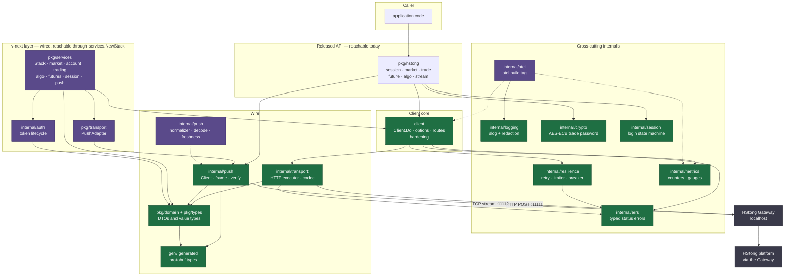

# Architecture

How `hstongapi4go` is put together, derived from the GitNexus knowledge graph for
this repository and then verified against the source.

- **Graph:** 10,048 nodes · 35,458 edges · 297 clusters · 876 execution flows
  across 408 indexed files
- **Index point:** commit `3b38e43` (2026-09-29), rebuilt with
  `gitnexus analyze --index-only`. The previous snapshot was `eb00cbd`, 102
  commits behind; its figures were left stale rather than invented until this
  rebuild.
- **Method:** Leiden communities aggregated by label, execution flows joined
  through `STEP_IN_PROCESS`, package dependencies read from `IMPORTS` edges and
  rolled up to package level
- **Design rationale:** [docs/DESIGN.md](./docs/DESIGN.md) · **Decisions:**
  [docs/adr/README.md](./docs/adr/README.md) · **Adversarial analysis:**
  [docs/threat-model.md](./docs/threat-model.md)

> The graph is a static approximation with real limits, listed in
> [§8](#8-known-limits-of-this-document). The most consequential finding is that
> the v-next layer is fully present in the graph but **not reachable by a caller**.

## 1. Overview

`hstongapi4go` is a Go client SDK for the HStong (華盛) Quant OpenAPI **local
Gateway**. The Gateway is a separate process on loopback that owns platform
connectivity, login, request signing, and platform keys; the SDK holds no
platform credentials and performs no signing ([ADR 0001](./docs/adr/0001-gateway-transport.md),
[ADR 0005](./docs/adr/0005-key-model-and-push-verification.md)).

Two transports, both to `127.0.0.1`:

- **HTTP `POST :11111`** — 51 endpoints behind a `{"timeout_sec", "params"}` /
  `{"ok", "err", "data"}` envelope, plain JSON.
- **TCP `:11112`** — a fixed 151-byte frame header carrying binary protobuf
  `PBNotify` messages, decoded by `Any` type URL.

The canonical endpoint and topic inventory is
[docs/SPEC.md](./docs/SPEC.md) and is deliberately not restated here.

The repository contains **two SDK layers**. The **released** layer (`client`,
`pkg/hstong`, `internal/*`) is what callers use. The **v-next** layer (`pkg/domain`,
`pkg/services`, `pkg/transport`, `internal/auth`) was added by the 2026-09-23
enterprise run and is **not wired in** — see [§5](#5-the-v-next-layer-is-present-but-unreachable).

## 2. Functional areas

Regenerated 2026-09-29 from a fresh `gitnexus analyze --index-only`, at commit
`3b38e43`: **408 files, 10,048 nodes, 35,458 edges, 297 clusters, 876 flows.**
The previous figures here came from an index built at `eb00cbd0`, **102 commits
behind**, and were left stale rather than invented - see docs/VNEXT.md for why.
The index is a local artifact and is not committed, so these numbers are
reproducible by re-running the analyze.

Symbol counts are summed across every cluster carrying each label. One caveat
the fresh index makes visible and the old one hid: it now includes test files, so
**test symbols outnumber production symbols in most areas.** `pkg/services` is
the clearest case - `push_test.go` alone contributes 107 symbols against 66 for
`push.go`. These totals therefore measure where the repository's logic and its
verification live together, not production size alone.

| Area | Symbols | Clusters | Leading packages | Role |
|------|--------:|---------:|------------------|------|
| Services | 990 | 45 | `pkg/services`, `pkg/domain`, `internal/errs`, `client` | v-next use cases: market, account, trading, algo, futures, push |
| Push | 177 | 13 | `internal/push`, `test/mockgateway`, `gen/hq/notify`, `gen/common/msg` | Framing, decode, verification, freshness |
| Domain | 130 | 25 | `pkg/domain`, `pkg/transport`, `internal/push`, `pkg/services` | Wire DTOs and v-next value types |
| Trade | 127 | 10 | `pkg/hstong/trade`, `pkg/hstong` | Order lifecycle and asset queries |
| Transport | 124 | 14 | `internal/transport`, `pkg/transport`, `client` | HTTP executor, envelope, codec dispatch, response cap |
| Stream | 104 | 14 | `pkg/hstong/stream`, `client`, `internal/push` | Subscription and push event API |
| Paritygate | 79 | 6 | `scripts/paritygate` | SPEC to v-next endpoint parity guard |
| Algo | 77 | 3 | `pkg/hstong/algo`, `pkg/services` | Algo-trading endpoints |
| Auth | 69 | 8 | `internal/auth`, `internal/crypto` | Password crypto, token lifecycle, login coalescing |
| Client | 68 | 8 | `client` | Construction, options, routes, hardening |
| Mockgateway | 63 | 9 | `test/mockgateway`, `cmd` | 51-route offline Gateway and push |
| Integration | 62 | 2 | `test/integration` | Env-gated real-Gateway tests |
| Dto | 62 | 16 | `gen/hq/dto`, `gen/trade` | Generated market and trade DTOs |
| Notify | 57 | 13 | `gen/hq/notify`, `gen/trade/notify` | Protobuf notification types |
| Scripts | 51 | 8 | `scripts` | Money check, coverage gate, SBOM, doc checks |
| Resilience | 46 | 6 | `internal/resilience`, `client` | Retry policy, rate limit, circuit breaker |
| Metrics | 34 | 2 | `internal/metrics` | Counters, gauges, histograms |
| Logging | 28 | 5 | `internal/logging` | `slog` with secret redaction |
| Future | 27 | 3 | `pkg/hstong/future` | Futures endpoints and delivery push |
| Market | 25 | 4 | `pkg/hstong/market` | Market pull endpoints and subscriptions |
| Otel | 25 | 4 | `internal/otel`, `client` | Tracing and metrics behind the `otel` tag |
| Layering | 21 | 3 | `internal/layering` | Machine-checked import boundaries |
| Hstong | 19 | 2 | `pkg/hstong` | Session manager surface |
| Errs | 15 | 2 | `internal/errs` | Typed status errors |
| Session | 15 | 2 | `pkg/hstong`, `internal/auth` | Login state machine |
| Crypto | 11 | 1 | `internal/crypto` | AES-192-ECB/PKCS7 trade password |
| Msg | 8 | 4 | `gen/common/msg` | Generated envelope and notify messages |
| Migration | 7 | 1 | `internal/migration` | Compiled MIGRATION.md samples |
| E2e | 5 | 1 | `test/e2e` | SDK-to-mock end-to-end tests |
| Types | 4 | 1 | `pkg/types` | Enums and status codes |
| Constant | 4 | 2 | `gen/common/constant` | Generated shared constants |

Three cross-cutting symbols dominate call-graph fan-in rather than belonging to
any one feature: `internal/metrics.RateLimitWait` participates in **306**
distinct flows, `internal/metrics.Count` in **236**, and `internal/errs.New` in
**160**. That ordering inverts the previous claim in this section that
`errs.New` was the widest - with tests indexed, the rate-limit and metrics
helpers sit on more flows than the error constructor. The old figures were not
wrong so much as measured on a smaller graph that excluded the tests.


## 3. Diagram

Edges are `IMPORTS` relationships between packages, confirmed in source.


```mermaid
flowchart TB
    subgraph APP["Caller"]
        A["application code"]
    end

    subgraph REL["Released API — reachable today"]
        HS["pkg/hstong<br/>session · market · trade<br/>future · algo · stream"]
    end

    subgraph CORE["Client core"]
        CL["client<br/>Client.Do · options · routes<br/>hardening"]
    end

    subgraph CROSS["Cross-cutting internals"]
        RES["internal/resilience<br/>retry · limiter · breaker"]
        ERR["internal/errs<br/>typed status errors"]
        LOG["internal/logging<br/>slog + redaction"]
        MET["internal/metrics<br/>counters · gauges"]
        OTL["internal/otel<br/>otel build tag"]
        CRY["internal/crypto<br/>AES-ECB trade password"]
        SES["internal/session<br/>login state machine"]
    end

    subgraph WIRE["Wire"]
        TRN["internal/transport<br/>HTTP executor · codec"]
        PSH["internal/push<br/>Client · frame · verify"]
        FAN["internal/push<br/>normalizer · decode · freshness"]
        DOM["pkg/domain + pkg/types<br/>DTOs and value types"]
        GEN["gen/ generated<br/>protobuf types"]
    end

    subgraph VNEXT["v-next layer — wired, reachable through services.NewStack"]
        SVC["pkg/services<br/>Stack · market · account · trading<br/>algo · futures · session · push"]
        PUA["pkg/transport<br/>PushAdapter"]
        AUT["internal/auth<br/>token lifecycle"]
    end

    GW["HStong Gateway<br/>localhost"]
    PLAT["HStong platform<br/>via the Gateway"]

    A --> HS
    HS --> CL
    HS --> PSH
    HS --> SES
    HS --> CRY
    CL --> TRN
    CL --> RES
    CL --> MET
    CL --> ERR
    TRN --> ERR
    TRN --> DOM
    PSH --> DOM
    PSH --> GEN
    RES --> ERR
    OTL --> LOG
    OTL -.-> CL
    OTL -.-> MET

    SVC --> CL
    SVC --> DOM
    SVC --> AUT
    SVC --> PUA
    PUA --> PSH
    AUT --> DOM
    FAN -.-> PSH
    DOM --> GEN

    TRN -->|"HTTP POST :11111"| GW
    PSH -->|"TCP stream :11112"| GW
    GW --> PLAT

    classDef active fill:#1f6f43,stroke:#0d4429,color:#fff
    classDef forward fill:#5a4a8a,stroke:#33265c,color:#fff
    classDef ext fill:#3a3a4a,stroke:#22222e,color:#fff
    class CL,TRN,RES,ERR,LOG,MET,CRY,SES,PSH,DOM,GEN active
    class SVC,PUA,AUT,FAN,OTL forward
    class GW,PLAT ext
```

Dashed edges are conditional: the `otel` packages compile only under the `otel`
build tag. The `FAN` node stands for `internal/push`'s
`normalizer.go`/`decode.go`/`freshness.go`, which do exist; the *types*
`internal/push.Manager` and `.Fanout` were removed on 2026-09-25, and that
retirement is why the node no longer names a manager. The `pkg/domain → gen`
edge is a real dependency that contradicts the declared boundary — see
[§6](#6-layering-deviations).

## 4. Key execution flows

Selected by centrality and consequence, not by step count: the auto-generated
flow labels are dominated by repetitive metrics and error-mapping chains
(`Do → GetCounter`, `Do → Error`, and similar). Traces are `STEP_IN_PROCESS`
edges from the current index.

### 4.1 Client construction — `examples/algo/main.go` → `client.New`

```
1. main            examples/algo/main.go
2.   New           client/client.go
3.     New         internal/transport/transport.go
4.       Config    internal/transport/transport.go
```

`client.New` applies functional options in order over defaults, then constructs
the transport that owns the envelope and per-endpoint codec. `client.New`
participates in 30 flows and `applyEnv`/`WithEnv` in 18 each, so configuration
is the most fan-in-heavy path in the released layer after error construction.

### 4.2 Every HTTP call — retry gate to transport

```
1. Do            internal/resilience/retry.go
2.   attempt     client/client.go
3.     Do        internal/transport/transport.go
4.       timeoutSeconds   internal/transport/transport.go
```

`resilience.Policy.Do` classifies the route and forces `max = 1` for anything in
`mutationPaths`, so trade, futures, and algo mutations issue exactly one attempt
at every configuration ([ADR 0003](./docs/adr/0003-no-auto-retry-orders.md)).
`client.attempt` performs the single outbound call and `transport.Do` owns the
`{"timeout_sec","params"}` envelope, the deadline, and the codec dispatch. The
metrics and OTel span chain hangs off this same path:

```
1. Do            client/client.go
2.   execute     client/client.go
3.     attempt   client/client.go
4.       RateLimitWait   internal/metrics/metrics.go
5.       Count           internal/metrics/metrics.go
6.       Record          internal/otel/otel.go
7.         getCounter    internal/otel/otel.go
```

### 4.3 Order submission — `trade.Manager.Entrust`

```
1. Entrust          pkg/hstong/trade/orders.go
2.   call           pkg/hstong/trade/assets.go
3.     EnsureLoggedIn   pkg/hstong/session.go
4.       BeginLogin     internal/session/state.go
```

Local validation runs first, then single-flight session enforcement, then the
call is classified as a mutation. Note what is **absent**: no retry step. That
absence is the ADR 0003 guarantee, and it is why an ambiguous failure returns a
typed error asking the caller to reconcile rather than resubmitting.

### 4.4 Login and token persistence — `auth.Authenticator.Login`

```
1. Login       internal/auth/authenticator.go
2.   SaveToken internal/auth/token_manager.go
3.     Now     internal/auth/session_security_test.go
```

The password is AES-192-ECB/PKCS7 encrypted before it leaves the process, then
the token is stored with a computed expiry and refresh time. The `Clock` is
injectable, which is what makes expiry testable without wall-clock dependence.
A second recorded flow shows the crypto half in isolation:

```
1. Login                     internal/auth/authenticator.go
2.   EncryptTradePassword    internal/auth/session.go
3.     EncryptTradePassword  internal/crypto/aes.go
4.       encryptECB          internal/crypto/aes.go
5.         pkcs7Pad          internal/crypto/aes.go
```

Step 3 of the first trace is a **graph artifact**: `Now` is defined on both the
real clock and a test fake, and the analyzer attributed it to the test file. See
[§8](#8-known-limits-of-this-document).

### 4.5 Push ingest and reconnect — `push.Client.readLoop`

> **Stale entry, retained for history.** This trace was extracted from the
> knowledge graph when `push.Manager` still existed. `Manager` and `Fanout` were
> retired on 2026-09-25 (`docs/VNEXT.md` §5), so the symbols below no longer
> exist. The live path is `push.Client`, whose trace is `readLoop → decodeNotification
> → dispatch`. This section is regenerated at the v1.0 milestone.

```
1. readLoop            internal/push/manager.go   [REMOVED]
2.   reconnectLoop     internal/push/manager.go   [REMOVED]
3.     resubscribeAll  internal/push/manager.go   [REMOVED]
4.     sendTopicRequest    internal/push/manager.go   [REMOVED]
5.       buildTopicRequest internal/push/manager.go   [REMOVED]
```

The read loop consumes 151-byte frames, skips heartbeats, decodes `PBNotify`
payloads, and on a read error closes the connection and walks the reconnect
ladder. This was the v-next `Manager`; the released stream API uses
`internal/push.Client`, which has a separate lifecycle and is the survivor.

## 5. The v-next layer, and who can reach it

Verified by import search over non-test Go files, excluding `test/`, `cmd/`,
`examples/`, `scripts/`, `docs/`, `site/` and `internal/migration` — confirmed in
source, not inferred, and checked by
`TestVNextImportersInSection5AreAccurate` so the table cannot go stale again.
`internal/migration` is excluded because it is the compiled documentation-samples
package that keeps MIGRATION.md honest; it is not SDK code and nothing depends on
it.

| Package | Imported by SDK production code? |
|---------|----------------------------------|
| `pkg/domain` | **Yes**, by v-next code only: `internal/auth`, `internal/push`, `pkg/services`, `pkg/transport` |
| `pkg/services` | **No.** Nothing in the SDK imports it |
| `pkg/transport` | **No.** Nothing in the SDK imports it |
| `internal/auth` | **Yes** — `pkg/services/session.go` |
| `internal/push.Manager`, `.Fanout` | **Removed 2026-09-25.** Retired as part of the Option A decision |
| `pkg/transport.Adapter` | **Removed 2026-09-26.** See consequence 3 |

**"Not imported" is not "unreachable", and the distinction is the point.** The two
v-next entry points are *exported symbols* rather than importers: a caller writes
`services.NewStack(c)` or `transport.NewPushAdapter()` and constructs the layer
from outside. A repository-wide import search would never see that, which is why
the table above reads "nothing imports it" and the layer is nonetheless usable —
and is now exercised end to end against the mock Gateway.

The one asymmetry worth stating: `internal/auth` and `internal/push` *are*
imported by v-next code, so their hardening is reachable through the layer even
though no released package imports it.

Consequences worth stating plainly:

1. `internal/push` has a single connection lifecycle. The v-next `Manager` and
   `Fanout` were removed because they implemented a *different protocol* — TCP
   topic subscription — rather than a second version of the released one, and no
   test had ever checked that assumption against a live Gateway. The two
   behavioural differences the graph previously recorded here no longer exist
   because there is nothing left to disagree with.
2. **The v-next auth hardening now protects a caller** (through
   `SessionService`), where before this run it protected nobody.
3. `pkg/services` calls `client` directly and reaches TCP push through the
   `services.PushTransport` interface it declares, not through a
   `pkg/transport` adapter. The `Adapter` that once sat between them was
   **removed rather than adopted**: reading both `Do` implementations showed it
   would have dropped rate limiting, circuit breaking, metrics and tracing from
   every v-next call, and it had no production caller. The concrete push adapter
   that exists today is `PushAdapter`, and it implements an interface the
   services declare — the opposite direction, and the reason a new boundary rule
   now forbids `pkg/services` importing `pkg/transport` at all.

## 6. Layering deviations

Read directly from `IMPORTS` edges and checked against the source. Each
contradicts a boundary stated in ADR 0010, in
[docs/runs/2026-09-23-hstong-enterprise-sdk/ARCHITECTURE.md](./docs/runs/2026-09-23-hstong-enterprise-sdk/ARCHITECTURE.md),
or in a package's own doc comment.

| Declared boundary | Actual | Evidence |
|-------------------|--------|----------|
| `pkg/domain` depends on stdlib and `decimal` only | It imports generated code | 18 non-test `IMPORTS` edges `pkg/domain → gen/hq/dto`; `pkg/domain/market.go:11`, `pkg/domain/symbol.go:7` |
| Wire-to-domain conversion happens in the transport layer | `pkg/domain` performs it | `QuoteFromDTO`, `AccountBalanceFromDTO`, `EntrustFromWire` and peers live in `pkg/domain` |
| `pkg/services` depends on `domain` plus service interfaces | It imports `client` (30 file edges) | `pkg/services/account.go:9`, `market.go:10`, `trading.go:12` |
| `pkg/transport` implements the service interfaces | Nothing in the SDK imports it | no production importer outside the coverage gate — and this is now a **rule**, not an observation: `internal/layering` fails if `pkg/services` imports `pkg/transport` |
| Import rules are "enforced by go build, review, and golangci-lint" | **Closed.** Seven boundaries are machine-checked by `internal/layering`, which parses the repository's own imports and is verified by planting a violating import | `internal/layering/layering_test.go` |

These are recorded as candidates in
[the next-phase plan](./docs/runs/2026-09-23-hstong-enterprise-sdk/next-phase.md)
rather than fixed here, because deciding the v-next layer's fate is a product
decision, not a refactor.

## 7. Request and event lifecycles

**HTTP request.** `pkg/hstong` manager → `client.Client.Do` (route, breakers) →
`resilience.Policy.Do` (classification, single-attempt for mutations) →
`internal/transport.Transport.Do` (envelope, deadline, codec) → Gateway. Response
`ok:false` becomes a typed `internal/errs.Error` carrying a `types.StatusCode`.

**Push event.** Gateway frame → `internal/push.ReadFrame` (151-byte header,
length and compression checks) → `PBNotify` → `Any` unpack by `notifyMsgType` →
optional `SHA1WithRSA` verification → typed accessor on the stream `Event` →
dispatch to per-type queues with drop-oldest backpressure.

**Domain conversion (v-next).** `pkg/transport/mappers.go` and the mappers in
`pkg/domain` convert generated DTOs into `pkg/domain` values, so the domain sees
decimals and typed IDs rather than wire strings.

## 8. Known limits of this document

- **Flows are truncated.** The analyzer reported that 377 of 577 candidate entry
  points never ranked into the 876 recorded flows, 2,188 callees were skipped at
  the branching cap, 95 deduplicated flows were dropped at the process cap, and 70
  walks were cut by the per-entry budget. An absent flow does not mean the code
  path does not exist.
- **Clusters are fine-grained.** The 297 Leiden communities are far smaller than
  the 31 areas in §2, and labels repeat across communities, which is why the
  table sums them.
- **File-level import edges do not prove symbol use.** `pkg/hstong/stream`
  imports the `internal/push` package, which the graph records as an edge to one
  of its files; only `push.Client` is actually used. §5 was therefore confirmed
  with a symbol search, not the edge alone.
- **Homonymous methods can be misattributed.** `Now` in §4.4 is a production
  method on the real clock but resolves to a test fake in the graph.
- **Search was unavailable.** The LadybugDB FTS extension cannot load on this
  host, so every finding here comes from structural graph queries rather than
  keyword or semantic search.
- **The index is a point-in-time snapshot** at commit `3b38e43`, counting 10,048
  nodes across 408 indexed files. Re-run `gitnexus analyze --index-only` after
  landing further commits, and regenerate §2 and the flow figures below from it.
  The gap between snapshot and HEAD is the single most likely reason a number
  here is wrong: the previous snapshot was 102 commits behind before this
  rebuild, and nothing in the build detects that.
- **Structural claims were verified against source**, not taken from the graph
  alone. Every statement in §5 and §6 was confirmed by import and symbol search;
  the diagram's edges come from the graph, but the conclusions were checked by
  hand.
